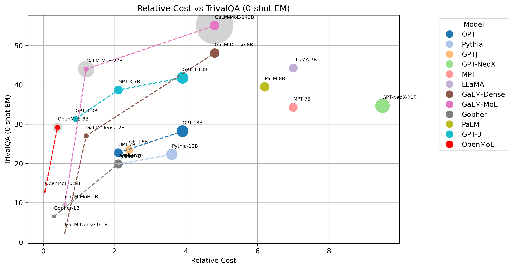

# OpenMoE
| [**Blog**](https://www.notion.so/Aug-2023-OpenMoE-v0-2-Release-43808efc0f5845caa788f2db52021879) | [**Twitter**](https://twitter.com/XueFz) | [**Discord**](https://discord.gg/bjGnGfjegU) |

OpenMoE is a project aimed at igniting the open-source MoE community! We are releasing a family of open-sourced Mixture-of-Experts (MoE) Large Language Models.

Since we are a small team working on a huge project, we cannot handle everything. Instead, we release some intermediate checkpoints in this repo to invite more contributors to work on open-sourced MoE project together!

## News

[2023/08] 🔥 We released an intermediate OpenMoE-8B checkpoint (OpenMoE-v0.2) along with two other models. Check out the blog [post](https://www.notion.so/Aug-2023-OpenMoE-v0-2-Release-43808efc0f5845caa788f2db52021879).

## TODO List

- [ ] PyTorch Implementation with Colossal AI
- [ ] More Evaluation
- [ ] Continue Training to 1T tokens
- [ ] Paper

## Contents
- [Model Weights](#model-weights)
- [Get Started](#get-started)
- [Approach](#approach)
- [License](#license)
- [Authors](#authors)
- [Citation](#citation)


## Model Weights
Currently, three models are released in total.


| Model Name     | Description                      | #Param   | GCS | Huggingface | Gin File   |
|----------------|-------------------------------------------------|----------|-------------|-------------|----------  |
| OpenMoE-base/16E   | A small MoE model for debugging                 |637M      |gs://openmoe/openmoe-base/checkpoint_500000 |[Link](https://huggingface.co/fuzhao/OpenMoE_Base) |[Link](https://github.com/XueFuzhao/t5x/blob/main/t5x/examples/t5/t5_1_1/examples/openmoe_base.gin)  |   
| OpenLLaMA-base | A dense counter-part of OpenMoE-base            |310M      |gs://openmoe/openllama-base/checkpoint_500000|[Link](https://huggingface.co/fuzhao/OpenLLaMA_Base) |[Link](https://github.com/XueFuzhao/t5x/blob/main/t5x/examples/t5/t5_1_1/examples/openllama_base.gin)  |     
| OpenMoE-8B/32E    | 8B MoE with comparable FLOPs of a 2B LLaMA      |8B        |gs://openmoe/openmoe-8b/checkpoint_100000|[Link](https://huggingface.co/fuzhao/OpenMoE_8B) |[Link](https://github.com/XueFuzhao/t5x/blob/main/t5x/examples/t5/t5_1_1/examples/openmoe_large.gin) |

We release all these checkpoints on Huggingface and Google Cloud Storage. For instance, you can download openmoe-8B with 
```
gsutil cp -r gs://openmoe/openmoe-8b/checkpoint_100000 $YOUR_DIR
```

The base models are trained with 128B tokens. The openmoe-8B checkpoint with 4 MoE layers and 32 experts has been trained by 200B tokens. We are still training OpenMoE-8B. So if you are interested in the latest checkpoint, please feel free to drop Fuzhao an email (f.xue@u.nus.edu). In addition, we are highly interested in training this model until saturate by performing multi-epoch training, which means we may train our model for over 2T and even more tokens (this depends on the resource we can get in the coming months)

Note: downloading data from Google Cloud Storage is not free, but you can sign in to Google Cloud and get some credits.


## Get Started

### Training

Get a TPU-vm and run the following code on all TPUs. Researcher can apply [TPU Research Cloud](https://sites.research.google/trc/about/) to get the TPU resource.

We are working on the PyTorch + GPU implementation with [Colossal AI](https://github.com/hpcaitech/ColossalAI).
```
git clone https://github.com/XueFuzhao/OpenMoE.git
bash OpenMoE/script/run_pretrain.sh
```


### Eval

Get a TPU-vm and run the following code on all TPUs.
```
git clone https://github.com/XueFuzhao/OpenMoE.git
bash OpenMoE/script/run_eval.sh
```


## Approach
### Data
50% The RedPajama + 50% The Stack Dedup.
We use a high ratio of coding data to improve reasoning ability.

### Tokenizer
We use the [umt5 Tokenizer](https://arxiv.org/abs/2304.09151) to support multi-lingual continue learning in the future, which can be downloaded on [Huggingface](https://huggingface.co/google/umt5-small/tree/main) or [Google Cloud](https://github.com/google-research/t5x/blob/main/docs/models.md#umt5-checkpoints).

### Model Architecture
OpenMoE is based on [ST-MoE](https://arxiv.org/abs/2202.08906) but uses Decoder-only architecture. The detailed implementation can be found in Fuzhao's [T5x](https://github.com/XueFuzhao/t5x) and [Flaxformer](https://github.com/XueFuzhao/flaxformer) repo.

### Training Objective
We use a modified UL2 training objective but Casual Attention Mask (We use more prefix LM and high mask ratio because it saves computation.):
- 50% prefix LM
- 10% span len=3 mask ratio=0.15
- 10% span len=8 mask ratio=0.15
- 10% span len=3 mask ratio=0.5
- 10% span len=8 mask ratio=0.5
- 10% span len=64 mask ratio=0.5

### Other Designs
RoPE, SwiGLU activation, 2K context length. We will release a more detailed report soon.

## Evaluation

We evaluate our model on TrivalQA and BigBench-Lite as our first step. We plot the cost-effectiveness curve in the figure below. 

Relative Cost is approximated by multiplying activated parameters and training tokens. The size of dots denotes the number of activated parameters for each token. The lightgray dot denotes the total parameters of MoE models.


For more detailed results, please see our [Blog](https://www.notion.so/Aug-2023-OpenMoE-v0-2-Release-43808efc0f5845caa788f2db52021879)


## License

Our code is under Apache 2.0 License.

Since the models are trained on The Redpajama and The Stack dataset, please check the license of these two datasets for your model usage.


## Authors

This project is currently contributed by the following authors:

- [Fuzhao Xue](https://xuefuzhao.github.io/)
- [Zian Zheng](https://www.linkedin.com/in/zian-zheng-21a715239)
- [Yao Fu](https://franxyao.github.io/)
- [Jinjie Ni](http://jinjie.one/)
- [Zangwei Zheng](https://zhengzangw.github.io/)
- [Wangchunshu Zhou](https://michaelzhouwang.github.io/)
- [Yang You](https://www.comp.nus.edu.sg/~youy/)


## Citation

Please cite the repo if you use the model and code in this repo.

```bibtex
@misc{openmoe2023,
  author = {Fuzhao Xue, Zian Zheng, Yao Fu, Jinjie Ni, Zangwei Zheng, Wangchunshu Zhou and Yang You},
  title = {OpenMoE: Open Mixture-of-Experts Language Models},
  year = {2023},
  publisher = {GitHub},
  journal = {GitHub repository},
  howpublished = {\url{https://github.com/XueFuzhao/OpenMoE}},
}
```


