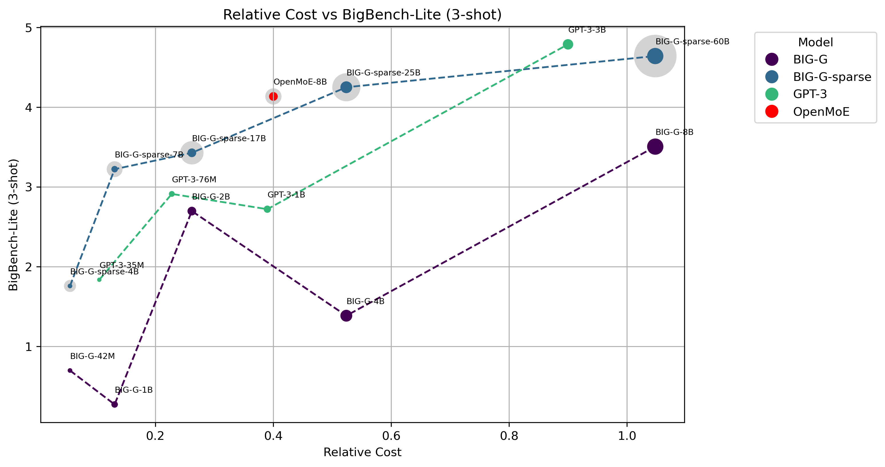
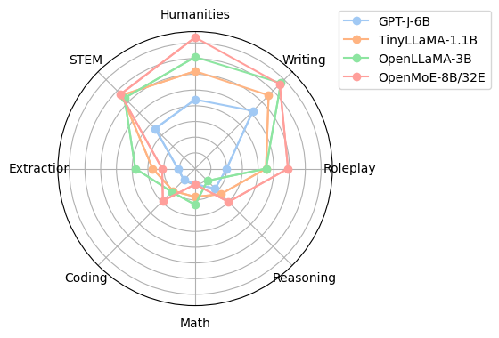

<p align="center">

</p>
<p align="center"><a href="https://github.com/XueFuzhao/OpenMoE/tree/main">[Homepage]</a> | <a href="https://arxiv.org/abs/2402.01739">[Paper]</a> |  <a href="https://colab.research.google.com/drive/1xIfIVafnlCP2XVICmRwkUFK3cwTJYjCY#scrollTo=62T-2mH_tsjG">[Colab Demo]</a> | <a href="https://huggingface.co/OrionZheng">[Huggingface]</a> | <a href="https://discord.gg/bjGnGfjegU">[Discord]</a>  |  <a href="https://twitter.com/xuefz/status/1693696988611739947?s=61&t=Xc2k2W7vU_hlpNizGDCmOw">[Twitter]</a> | <a href="https://xuefuzhao.notion.site/Aug-2023-OpenMoE-v0-2-Release-43808efc0f5845caa788f2db52021879">[Blog]</a></p>
</p>
<hr>

# OpenMoE
OpenMoE is a project aimed at igniting the open-source MoE community! We are releasing a family of open-sourced Mixture-of-Experts (MoE) Large Language Models.

Our project began in the summer of 2023. On August 22, 2023, we released the first batch of intermediate checkpoints (OpenMoE-base&8B), along with the data and code [[Twitter]](https://twitter.com/xuefz/status/1693696988611739947?s=61&t=Xc2k2W7vU_hlpNizGDCmOw). Subsequently, the OpenMoE-8B training was completed in November 2023. After that, we embarked on explorations on the 34B scale model, which is still ongoing.

As a small student team, instead of pursuing the best model with better data, computation, and human power, we devote to fully sharing our training data, strategies, model architecture, weights, and everything we have with the community. We hope this project will promote research on this promising field and invite more contributors to work on open-sourced MoE projects together!

## News

[2024/01] 🔥 We release OpenMoE paper! We conducted an in-depth routing analysis and found many interesting stuff. Check it [here](https://github.com/XueFuzhao/OpenMoE/blob/main/paper/paper.pdf)!

[2024/01] 🔥 OpenMoE-8B-Chat is now available. We've provided a Colab inference [demo](https://colab.research.google.com/drive/1xIfIVafnlCP2XVICmRwkUFK3cwTJYjCY) for everyone to try, as well as a [tutorial](https://colab.research.google.com/drive/1eIT1rtG7pORRQAYtQoMOAekUg7aZLDdn) on converting JAX checkpoints to PyTorch checkpoints(Note: both require Colab Pro).

[2023/11] 🔥 Thanks to Colossal AI! They released one [PyTorch OpenMoE implementation](https://github.com/hpcaitech/ColossalAI/tree/main/examples/language/openmoe) including both training and inference with expert parallelism.

[2023/08] 🔥 We released an intermediate OpenMoE-8B checkpoint (OpenMoE-v0.2) along with two other models. Check out the blog [post](https://xuefuzhao.notion.site/Aug-2023-OpenMoE-v0-2-Release-43808efc0f5845caa788f2db52021879).

## TODO List

- [x] PyTorch Implementation with Colossal AI
- [x] Continue Training to 1T tokens
- [ ] More Evaluation
- [ ] Paper

## Contents
- [Model Weights](#model-weights)
- [Get Started](#get-started)
- [Approach](#approach)
- [License](#license)
- [Authors](#authors)
- [Citation](#citation)


## Model Weights
Currently, three models are released in total: OpenMoE-base, OpenMoE-8B/8B-Chat, and OpenMoE-34B(at 200B tokens). 

The table below lists the 8B/8B-Chat model that has completed training on 1.1T tokens.

| Model Name     | Description                      | #Param   |Huggingface |
|----------------|-------------------------------------------------|----------|-------------|
| **OpenMoE-8B(1.1T)**   | 8B MoE with comparable FLOPs of a 2B LLaMA(No SFT)  |8B        |[Link](https://huggingface.co/OrionZheng/openmoe-8b) |
| **OpenMoE-8B-Chat (1.1T+SFT)**   | OpenMoE-8B-1.1T supervised finetuned on the [WildChat GPT-4 Subset](https://huggingface.co/datasets/allenai/WildChat-nontoxic)   |8B        |[Link](https://huggingface.co/OrionZheng/openmoe-8b-chat) |


Besides, we also provide all our intermediate checkpoints(base, 8B, 34B) for research purposes.

| Model Name     | Description                      | #Param   |Huggingface |
|----------------|-------------------------------------------------|----------|-------------|
| **OpenMoE-34B-200B**   |  34B MoE with comparable FLOPs of a 7B LLaMA(No SFT)  |34B        |[Link](https://huggingface.co/OrionZheng/openmoe-34b-200B) |
| OpenMoE-8B-200B   | 8B MoE with comparable FLOPs of a 2B LLaMA(No SFT) |8B        |[Link](https://huggingface.co/OrionZheng/openmoe-8b-200B) |
| OpenMoE-8B-400B   | 8B MoE with comparable FLOPs of a 2B LLaMA(No SFT)  |8B        |[Link](https://huggingface.co/OrionZheng/openmoe-8b-400B) | 
| OpenMoE-8B-600B   | 8B MoE with comparable FLOPs of a 2B LLaMA(No SFT) |8B        |[Link](https://huggingface.co/OrionZheng/openmoe-8b-600B) |
| OpenMoE-8B-800B   | 8B MoE with comparable FLOPs of a 2B LLaMA(No SFT)  |8B        |[Link](https://huggingface.co/OrionZheng/openmoe-8b-800B) | 
| OpenMoE-8B-1T   | 8B MoE with comparable FLOPs of a 2B LLaMA(No SFT)  |8B        |[Link](https://huggingface.co/OrionZheng/openmoe-8b-1T) | 
| OpenMoE-base(128B)   | A small MoE model for debugging only       |637M      |[Link](https://huggingface.co/OrionZheng/openmoe-base) |  
| OpenLLaMA-base(128B) | A dense counter-part of OpenMoE-base            |310M      |[Link](https://huggingface.co/fuzhao/OpenLLaMA_Base) |


The base model, which was trained using 128 billion tokens, served primarily for debugging purposes. After validating the effectiveness of our model architecture, we did not pursue further training. Consequently, their performance might not be very good, and the checkpoints are not suitable for practical applications. Better performance can be observed from our 8B or 34B versions.

The OpenMoE-8B with 4 MoE layers and 32 experts has been trained by 1.1T tokens. The SFT version has also been released after we finetuned the OpenMoE-8B-1.1T on the [wildchat]((https://huggingface.co/datasets/allenai/WildChat-nontoxic)) dataset's GPT-4 subset. The intermediate checkpoints at 200B, 400B, 600B, 800B, 1T tokens can be used to study the training dynamics of MoE architecture.

We are still training our OpenMoE-34B, which is a MoE model with 8 MoE layers and 32 experts. We released the intermediate checkpoint trained on 200B tokens on Huggingface. If you are interested in the latest checkpoint, please feel free to drop Fuzhao an email (f.xue@u.nus.edu).

## Get Started

### Inference with Pytorch
Our PyToch implementation is supported by [Colossal AI](https://github.com/hpcaitech/ColossalAI). You can install our forked version directly for easier setup:
```
# Install ColossalAI
git clone --branch my_openmoe https://github.com/Orion-Zheng/ColossalAI.git
pip install ./ColossalAI
python -m pip install -r ./ColossalAI/examples/language/openmoe/requirements.txt
```

Then, you can do inference by:
```
from transformers import AutoTokenizer, AutoConfig, AutoModelForCausalLM

model_path = "ckpts/openmoe-8b-chat"
config = AutoConfig.from_pretrained(model_path)
tokenizer = AutoTokenizer.from_pretrained(model_path, trust_remote_code=True)
model = AutoModelForCausalLM.from_pretrained(
    model_path,
    torch_dtype=torch.bfloat16,
    trust_remote_code=True, 
    device_map='auto'
    )
query = 'Question: How do I kill a process? Answer:'
prompt = f'''<<SYS>>
You are a helpful, respectful and honest assistant.
<</SYS>>

<s>[INST] {query} [/INST]'''

inputs = tokenizer(prompt, return_tensors="pt").to('cuda')
sample = model.generate(**inputs, max_new_tokens=32)
print(tokenizer.decode(sample[0]))
```

We also provide a Colab [tutorial](https://colab.research.google.com/drive/1eIT1rtG7pORRQAYtQoMOAekUg7aZLDdn) demonstrating the jax checkpoint conversion and execution of PyTorch model inference. You can experiment with OpenMoE-8B-Chat on Colab directly by [this](https://colab.research.google.com/drive/1xIfIVafnlCP2XVICmRwkUFK3cwTJYjCY)(Note: both require Colab Pro).
- Running OpenMoE-8B requires ~49GB of memory in float32 or ~23GB in bfloat16. It can be executed on a Colab `CPU High-RAM` runtime or an `A100-40GB` runtime, both of which require Colab Pro.The float16 precision is not recommended because sometimes it will lead to performance degradation.
- Runing the OpenMoE-34B requries ~89GB of memory in bfloat16 or ~180GB in float32. To perform inference on multiple devices/offloading model weights to RAM, please refer to the script [here](script/inference_on_multi_devices.py).
- A more detailed env setup script can be found [here](env/prepare_env.sh). Note: you don't need t5x and Jax dependency if you are using our [huggingface ckpts](https://huggingface.co/OrionZheng/openmoe-8b-chat)


### Training with TPU/GPU
1. **On TPUs:** Get a TPU-vm and run the following code on all TPUs. Researchers can apply [TPU Research Cloud](https://sites.research.google/trc/about/) to get the TPU resource.
```
git clone https://github.com/XueFuzhao/OpenMoE.git
bash OpenMoE/script/run_pretrain.sh
```
2. **On GPUs:** [ColossalAI](https://github.com/hpcaitech/ColossalAI/tree/main/examples/language/openmoe) provides a PyTorch + GPU implementation for OpenMoE and has optimized expert parallel strategies. However, we have recently noticed some issues[#5163](https://github.com/hpcaitech/ColossalAI/issues/5163),[#5212](https://github.com/hpcaitech/ColossalAI/issues/5212) raised about convergence problems. We are actively following up on these concerns and will soon update our GPU training tutorials.

### Evaluation with TPU/GPU
1. **On GPUs:** You can evaluate our model on MT-Bench by running the code below.
```
git clone https://github.com/Orion-Zheng/FastChat.git
cd FastChat && pip install -e ".[model_worker,llm_judge]"
cd FastChat/fastchat/llm_judge
python gen_model_answer.py --model-path LOCAL_PATH_TO_MODEL_CKPT/openmoe_8b_chat_ckpt\
                           --model-id openmoe-chat\
                           --dtype bfloat16
```
2. **On TPUs:** Get a TPU-vm and run the following code to evaluate the model on the BIG-bench-Lite.
```
git clone https://github.com/XueFuzhao/OpenMoE.git
bash OpenMoE/script/run_eval.sh
```

## Approach
### Data
#### Before 780B tokens:
50% The RedPajama + 50% The Stack Dedup.
We use a high ratio of coding data to improve reasoning ability.

#### After 780B tokens:

| dataset                        | Ratio (%) |
| -------------------------------| ----------- |
| redpajama_c4                   | 15.0        |
| redpajama_wikipedia            | 6.5         |
| wikipedia                      | 6.5         |
| redpajama_stackexchange        | 2.5         |
| redpajama_arxiv                | 4.5         |
| redpajama_book                 | 6.5         |
| redpajama_github               | 5.0         |
| redpajama_common_crawl         | 43.5        |
| the_stack_dedup                | 10.0        |

We found model tends to learn code faster than language. So we decide to reduce the coding data at the later stage of training.

Below are scripts to generate TFDS for pre-training datasets:   
The RedPajama: https://github.com/Orion-Zheng/redpajama_tfds  
The-Stack-Dedup: https://github.com/Orion-Zheng/the_stack_tfds  

### Tokenizer
We use the [umt5 Tokenizer](https://arxiv.org/abs/2304.09151) to support multi-lingual continue learning in the future, which can be downloaded on [Huggingface](https://huggingface.co/google/umt5-small/tree/main) or [Google Cloud](https://github.com/google-research/t5x/blob/main/docs/models.md#umt5-checkpoints).

### Model Architecture
OpenMoE is based on [ST-MoE](https://arxiv.org/abs/2202.08906) but uses Decoder-only architecture. The detailed implementation can be found in Fuzhao's [T5x](https://github.com/XueFuzhao/t5x) and [Flaxformer](https://github.com/XueFuzhao/flaxformer) repo.

### Training Objective

#### Before 780B tokens:
We use a modified UL2 training objective but Casual Attention Mask (We use more prefix LM and high mask ratio because it saves computation.):
- 50% prefix LM
- 10% span len=3 mask ratio=0.15
- 10% span len=8 mask ratio=0.15
- 10% span len=3 mask ratio=0.5
- 10% span len=8 mask ratio=0.5
- 10% span len=64 mask ratio=0.5

#### After 780B tokens:
Vanilla next token prediction, because we observed that UL2 objective tends to saturate at the later stage of training, although it enables model to learn things faster at start.

### Other Designs
RoPE, SwiGLU activation, 2K context length. We will release a more detailed report soon.

## Evaluation Results
### BigBench-Lite
We evaluate our model on BigBench-Lite as our first step. We plot the cost-effectiveness curve in the figure below. 

Relative Cost is approximated by multiplying activated parameters and training tokens. The size of dots denotes the number of activated parameters for each token. The lightgray dot denotes the total parameters of MoE models.



For more detailed results, please see our [Blog](https://www.notion.so/Aug-2023-OpenMoE-v0-2-Release-43808efc0f5845caa788f2db52021879) 

### MT-Bench
We perform evaluation on MT-Bench and observe that OpenMoE-8B-Chat outperformed dense LLMs trained with around two times effective FLOPs on the first Turn results.



## License

Our code is under Apache 2.0 License.

Since the models are trained on The Redpajama and The Stack dataset, please check the license of these two datasets for your model usage.


## Authors

This project is currently contributed by the following authors:

- [Fuzhao Xue](https://xuefuzhao.github.io/)
- [Zian Zheng](https://zheng-zian-andy.com)
- [Yao Fu](https://franxyao.github.io/)
- [Jinjie Ni](http://jinjie.one/)
- [Zangwei Zheng](https://zhengzangw.github.io/)
- [Wangchunshu Zhou](https://michaelzhouwang.github.io/)
- [Yang You](https://www.comp.nus.edu.sg/~youy/)

## Acknowledgement
The computational resources for this project were generously provided by the [Google TPU Research Cloud(TRC)](https://sites.research.google/trc/about/). We extend our heartfelt thanks to TRC for their invaluable support, which has been fundamental to the success of our work. Besides, we are extremely grateful to the [ColossalAI Team](https://github.com/hpcaitech/ColossalAI) for their tremendous support with the PyTorch implementation, especially [Xuanlei Zhao](https://oahzxl.github.io/) and [Wenhao Chen](https://github.com/CWHer), making training and inference of OpenMoE on GPUs a reality.

## Citation

Please cite the repo if you use the model and code in this repo.

```bibtex
@misc{xue2024openmoe,
      title={OpenMoE: An Early Effort on Open Mixture-of-Experts Language Models}, 
      author={Fuzhao Xue and Zian Zheng and Yao Fu and Jinjie Ni and Zangwei Zheng and Wangchunshu Zhou and Yang You},
      year={2024},
      eprint={2402.01739},
      archivePrefix={arXiv},
      primaryClass={cs.CL}
}
```

## Star History

[](https://star-history.com/#XueFuzhao/OpenMoE&Date)


