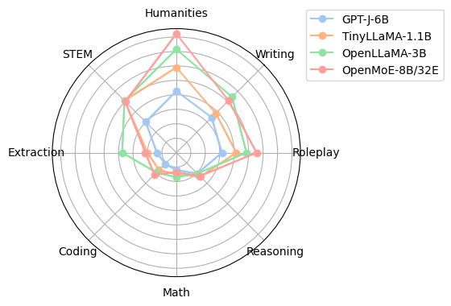
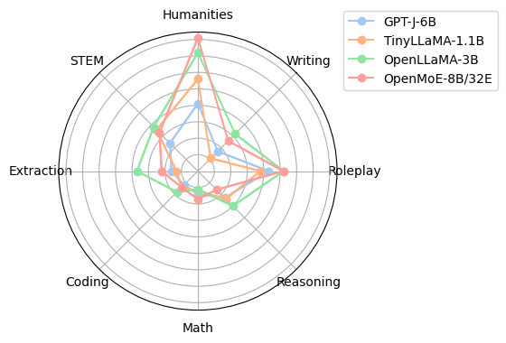

# Experimental Results

## MT-Bench

### Overall
Note: The baselines are used up to 2 times training FLOPs. OpenMoE-8B has similar FLOPs as a 1.6B dense model.

| Model            | Training Cost | Inference Cost | MT-Bench 1st Turn | MT-Bench 2nd Turn | MT-Bench Avg |
|------------------|---------------|-----------------|-------------------|-------------------|--------------|
| GPT-J-6B (0.4T)         | 2.4           | 6               | 2.51              | 2.35              | 2.43         |
| TinyLLaMA-1.1B (3T)   | 3.3           | 1.1             | 4.08              | 2.54              | 3.31         |
| OpenLLaMA-3B (1T)    | 3             | 3               | 4.36              | **3.62**              | **3.99**         |
| OpenMoE-8B/32E (1.1T)| 1.8           | 1.6             | **4.69**              | 3.26              | **3.98**         |

### First Turn

### Second Turn

